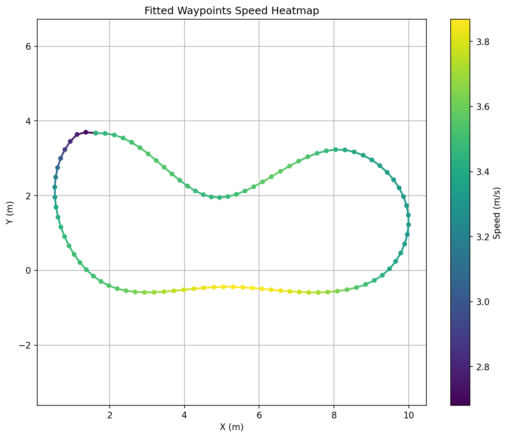
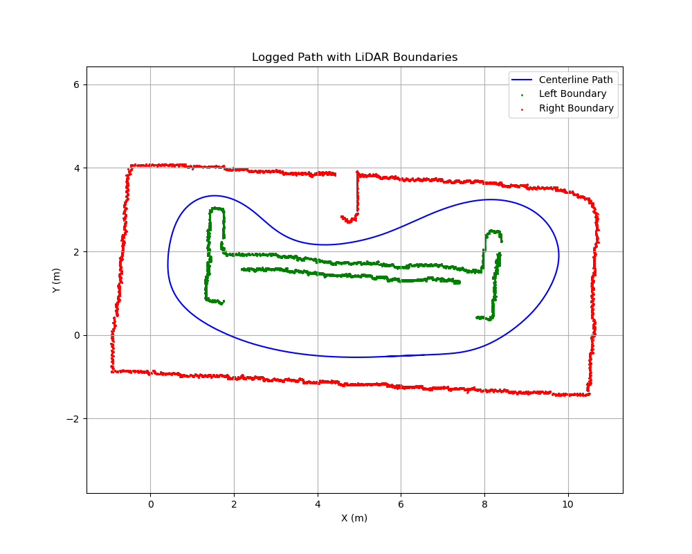
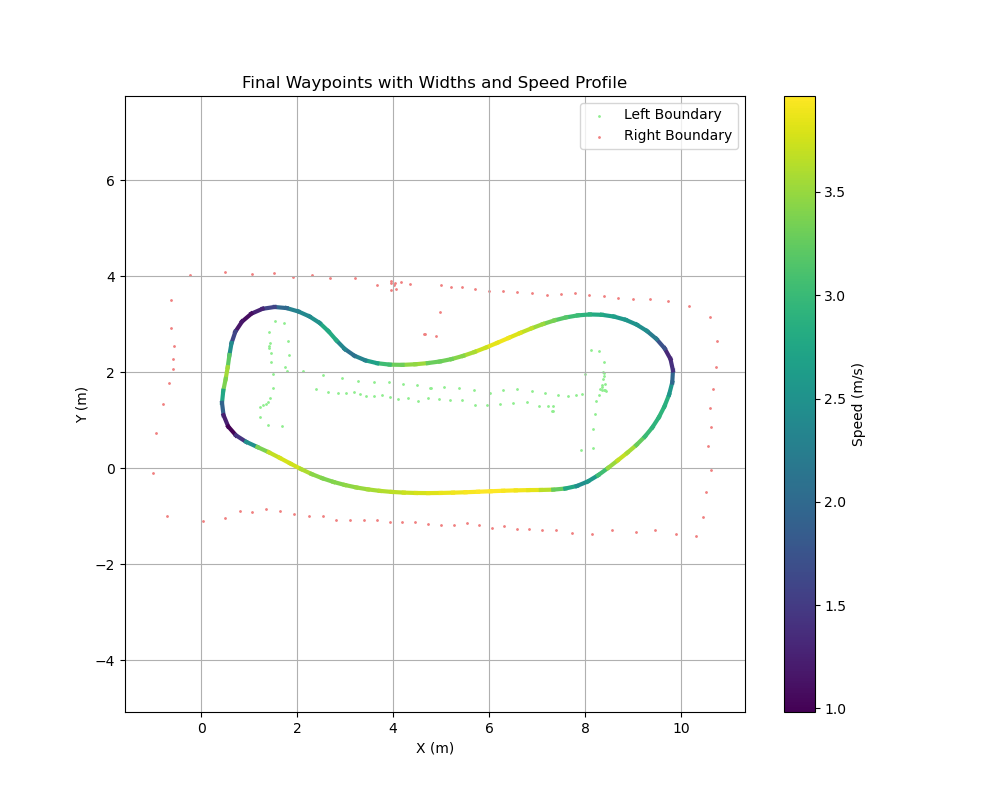

# 센터라인 추출 실행 순서

1. 손으로 Centerline 추출
```
ros2 launch path_planner checkpoint_recorder_launch.py
```
위 내용에 정규화 -> 가우시안 필터링 자동실행 추가 q누르면 저장


2. fernet 좌표계 형식으로 변환 및 가우시안 필터링으로 속도값 추가
```
python3 src/path_planner/scripts/traj_file_generator.py
```

<div style="text-align: center;">
  <div style="margin-bottom: 10px;">
    
    <p>거리 정보 저장</p>
  </div>
</div>

3. 시뮬레이션을 통해 centerline 기준 트랙 폭 저장

```
# 터미널 1
ros2 launch f1tenth simulation_full_system_launch.py
#터미널 2
ros2 run path_planner centerline_logger_node
```
<div style="text-align: center;">
  <div style="margin-bottom: 10px;">
    
    <p>거리 정보 저장</p>
  </div>
</div>


4. 위 두 csv 파일 통합
```
python3 src/path_planner/scripts/width_left_right_creator.py
```
<div style="text-align: center;">
  <div style="margin-bottom: 10px;">
    
    <p>거리 정보 저장</p>
  </div>
</div>


# 장애물 회피 및 추월 경로 계획

1. opponent_detection_node(opponent_detection.py)
LiDAR 센서와 차량의 위치를 데이터를 사용하여 트랙위의 상대 차량을 감지합니다.

- LiDAR 스캔 데이터를 포인트 클라우드로 변환하고, 이를 개별 객체로 군집화 합니다.
- 군집화된 장애물의 위치, 크기, 방향 등의 정보를 프레네(Frenet) 좌표계로 변환하여 /preception/obstacels 토픽으로 발행합니다.
- 시각화 토픽 : /perception/obstacels_markers_new

2. spliner_node(spliner.py)
opponent_detection_node가 감지한 장애물 정보를 바탕으로 회피 경로를 생성합니다. 

- /perception/obstacels 토피을 구독하여 장애물 정보 받기
- 가장 가까운 장애물을 기준으로, 안전 거리를 확보하며 부드러운 회피 경로를 3차 스플라인으로 생성
- 회피 경로는 7개의 제어점(장애물 3개, 장애물 위치1개, 장애물 후 3개)을 사용하여 계산되며, 차량의 현재 속도와 추월 방향(바깥 경로 , 안쪽 경로) 에 따라 동적으로 조정 됩니다.
- 생성된 회피 경로는 /planner/avoidance/otwpnts 토픽으로 발행 시각화 

3. state_machine_node(state_machine.py, state_helpers.py)
차량의 현재 상태를 결정하고, 그에 맞는 주행 경로(Local waypoints)를 생성한다.

- 차량의 상태를 GB_TRACK(기본 주행), OVERTAKE, TRAILING 으로 구분합니다. 
- spliner_node로부터 받은 회피 경로(/planner/avoidance/otwpnts)와 장애물 정보(/perception/obstacles)를 바탕으로 상태를 전환할지 결정합니다. (예: 전방에 장애물이 있고 회피 경로가 유효하면 OVERTAKE 상태로 전환합니다.)
- 현재 상태에 따라 최종적으로 따라야 할 지역 경로(Local Waypoints)를 결정합니다.
- GB_TRACK 상태: 미리 정의된 최적의 글로벌 경로를 따라갑니다.
- OVERTAKE 상태: spliner_node가 생성한 회피 경로와 글로벌 경로를 융합하여 따라갑니다.
- 결정된 지역 경로는 /state_machine/local_waypoints 토픽으로 발행되어 controller_node로 전달됩니다.
- 현재 차량의 상태를 /state_machine/state 토픽으로 발행하고, Rviz에 시각화합니다.

4. controller_node (controller.py)
   * 역할: state_machine_node로부터 받은 지역 경로를 따라 차량을 실제로 제어(조향 및 속도)합니다.
   * 주요 기능:
       * /state_machine/local_waypoints 토픽을 구독하여 주행할 경로를 받습니다.
       * Pure Pursuit 알고리즘을 사용하여 경로를 따라가기 위한 목표 조향각과 속도를 계산합니다.
       * 차량의 현재 위치( /odom ), 상태( /state_machine/state ), 장애물 정보( /perception/obstacles )를
         모두 고려하여 제어 값을 결정합니다.
           * 예: TRAILING 상태에서는 앞 차와의 거리를 유지하도록 속도를 조절합니다.
       * 계산된 최종 제어 명령(속도, 조향각)을 /drive 토픽으로 발행하여 시뮬레이터의 차량을 움직입니다.
       * Pure Pursuit 알고리즘의 Lookahead 지점을 Rviz에 시각화하여 디버깅을 돕습니다.


```
# 추가 설치
pip install "numpy>=1.21,<1.24" "scikit-image>=0.18,<0.22" filterpy


```