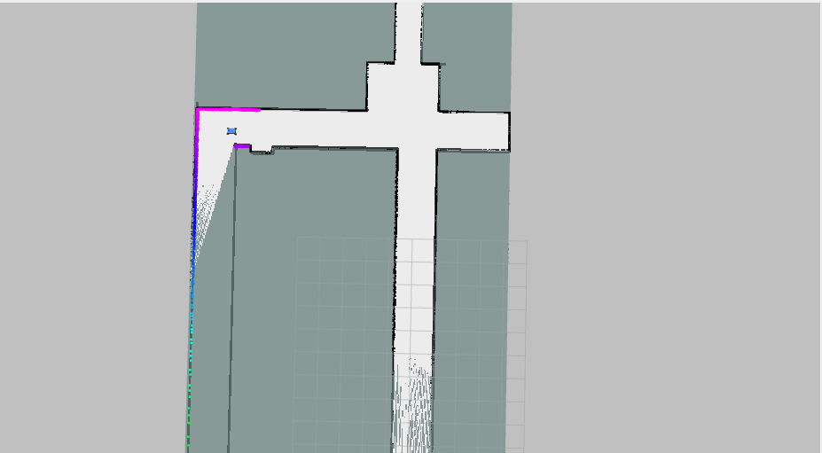

# F1TENTH ROS2 Simulation Workspace

F1TENTH 자율주행 레이싱을 위한 ROS2 시뮬레이션 환경입니다.

## 📋 시스템 요구사항

- **OS**: Ubuntu 20.04 LTS
- **ROS**: ROS2 Foxy
- **Python**: 3.8+

## 🔧 의존성 설치

```bash
# Git 리포지토리: f1tenth_gym_ros 브리지를 워크스페이스에 추가
cd ~/sim_ws/src
git clone https://github.com/t0mark/f1tenth_gym_ros.git

# Python 패키지 의존성
pip3 install setuptools==59.6.0 testresources wheel numpy matplotlib pyyaml \
  gymnasium pybullet-utils transforms3d

# 시스템 패키지 의존성
sudo apt-get update
sudo apt-get install -y python3-dev build-essential

# ROS2 패키지 의존성
sudo apt update
sudo apt install -y \
  ros-foxy-joint-state-publisher ros-foxy-joint-state-publisher-gui \
  ros-foxy-robot-state-publisher ros-foxy-xacro \
  ros-foxy-navigation2 ros-foxy-nav2-bringup \
  ros-foxy-rviz2 ros-foxy-tf2-tools ros-foxy-tf2-ros-py \
  ros-foxy-slam-toolbox
```

## 🚀 빌드 및 설치

```bash
# F1TENTH gym 설치
git clone https://github.com/t0mark/F1tenth .
cd f1tenth_gym && pip3 install -e .

# 워크스페이스 설정
cd ~/sim_ws
source /opt/ros/foxy/setup.bash
rosdep update && rosdep install -i --from-path src --rosdistro foxy -y
colcon build

# 환경 설정
echo "source ~/sim_ws/install/setup.bash" >> ~/.bashrc
source ~/.bashrc
```

## 📦 패키지

### 🏎️ [F1TENTH Gym ROS](f1tenth_gym_ros/)
F1TENTH 시뮬레이션과 ROS2 연결 브리지

- **실행**: `ros2 launch f1tenth_gym_ros gym_bridge_launch.py`
- **기능**: 시뮬레이션 환경, 센서 데이터, 제어 인터페이스
- **출력**: 시뮬레이션 전반에 필요한 토픽 및 TF

### 🗺️ [F1TENTH SLAM Toolbox](f1tenth_slam_toolbox/)
실시간 지도 생성 및 위치 추정

- **실행**: `ros2 launch f1tenth_slam_toolbox f1tenth_slam_launch.py`
- **기능**: SLAM, 지도 생성, 로봇 위치 추정
- **출력**: `/slam_map` (map 프레임)

<div align="center">
  
  <p><em>SLAM으로 생성된 지도 예시</em></p>
</div>

### 🧭 [F1TENTH Path Planner](f1tenth_path_planner/)
센터라인 기반 Global Path + LiDAR Local Path (제어 분리, 경로 생성만)

- **실행**: `ros2 launch f1tenth_path_planner path_planner_launch.py`
- **기능**: Global 경로 계획, LiDAR 기반 Local 장애물 회피
- **출력**: `/global_path` (map 프레임), `/local_path` (map 프레임)

<div align="center">
  
  <p><em>Global Path와 Local Path 시각화 예시</em></p>
</div>

### 🎮 [F1TENTH Control](f1tenth_control/)
Pure Pursuit 기반 차량 제어 모듈

- **실행**: `ros2 launch f1tenth_control pure_pursuit_launch.py`
- **기능**: Local/Global Path 추종, Pure Pursuit 조향 제어, 고정 속도 제어
- **출력**: `/drive` (AckermannDriveStamped)

<div align="center">
  
  <p><em>Pure Pursuit 제어 시스템 동작 데모</em></p>
</div>


## 🎮 기본 사용법

```bash
# 통합 실행
ros2 launch f1tenth f1tenth_system_launch.py

# 1단계: 시뮬레이션 실행
ros2 launch f1tenth_gym_ros gym_bridge_launch.py

# 2단계: Path Planning
ros2 launch f1tenth_path_planner path_planner_launch.py

# 3단계: Vehicle Control
ros2 launch f1tenth_control pure_pursuit_launch.py

# 옵션
# 인지 모듈: SLAM 실행
ros2 launch f1tenth_slam_toolbox f1tenth_slam_launch.py

# 수동 제어: 키보드 제어
ros2 run teleop_twist_keyboard teleop_twist_keyboard
```

---

<div align="center">

**🔗 자세한 내용은 각 패키지의 README를 참조하세요**

| 패키지 | 설명 | 링크 |
|--------|------|------|
| 🏎️ f1tenth_gym_ros | 시뮬레이션 브리지 | [📖 가이드](f1tenth_gym_ros) |
| 🗺️ f1tenth_slam_toolbox | SLAM 도구 | [📖 가이드](f1tenth_slam_toolbox) |
| 🧭 f1tenth_path_planner | 경로 계획 | [📖 가이드](f1tenth_path_planner) |
| 🎮 f1tenth_control | 차량 제어 | [📖 가이드](f1tenth_control) |

</div>
