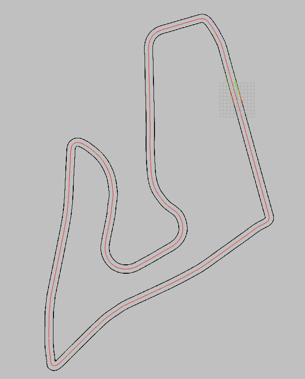
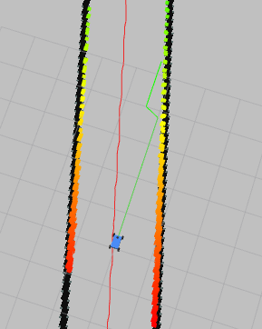

# 🧭 F1TENTH Path Planner

F1TENTH 자율주행을 위한 경로 계획 패키지입니다. Global 경로 계획과 LiDAR 기반 Local 장애물 회피를 담당합니다.

## 🚀 실행

```bash
# Path Planner 실행
ros2 launch f1tenth_path_planner path_planner_launch.py

# 체크포인트 기록 + 시뮬레이터(gym_bridge) 동시 실행
ros2 launch f1tenth_path_planner checkpoint_recorder_launch.py
```

## 🔧 노드 구성

### `global_centerline_node`
트랙 이미지를 읽어 스켈레톤화된 센터라인을 추출하고, 맵 좌표로 변환하여 `/global_path`에 `nav_msgs/Path`를 발행합니다.

**파라미터:**
- `map_path` (string): 맵 파일 경로 (확장자 제외). 비어있으면 `f1tenth_gym_ros/config/sim.yaml`에서 자동 로드
- `map_img_ext` (string): 이미지 확장자 (기본값 `.png`)
- `map_yaml_path` (string): YAML 파일 전체 경로 (기본값: `map_path + '.yaml'`)
- `sample_step_m` (double): 웨이포인트 간격(미터) (기본값 0.2)
- `publish_topic` (string): 출력 토픽 (기본값 `/global_path`)
- `save_centerline_overlay` (bool): `<맵>_centerline.png` 오버레이 저장 여부

### `local_avoidance_node`
`/global_path`와 `/scan`을 구독하여 LiDAR 클리어런스가 가장 좋은 횡방향 오프셋을 선택해 충돌 없는 단거리 지역 `/local_path`를 생성합니다.

**파라미터:**
- `global_path_topic` (string): Global path 토픽 (기본값 `/global_path`)
- `scan_topic` (string): LiDAR 토픽 (기본값 `/scan`, SLAM 수정 사용 시 `/scan_fixed`)
- `local_horizon` (double): 지역 경로 계획 거리(미터) (기본값 8.0)
- `path_resolution` (double): 경로점 간격(미터) (기본값 0.2)
- `lateral_offsets` (list): 후보 횡방향 오프셋(미터) (기본값 [0.0, 0.4, -0.4])
- `safety_radius` (double): 안전 반경(미터) (기본값 0.4)
- `base_frame` (string): 로봇 베이스 프레임 (기본값 `ego_racecar/base_link`)
- `map_frame` (string): 맵 프레임 (기본값 `map`)

### `checkpoint_recorder_node`
RViz의 Publish Point로 입력된 좌표를 순서대로 기록하고, 누적 경로를 CSV 및 Path 토픽으로 제공합니다.

**파라미터:**
- `map_frame` (string): 경로를 표현할 기준 프레임 (기본값 `map`)
- `output_csv_path` (string): 저장할 CSV 파일 경로 (기본값 `f1tenth_path_planner/data/checkpoints.csv`)
- `auto_save_on_add` (bool): 체크포인트 추가 시마다 자동 저장 여부 (기본값 `true`)
- `publish_topic` (string): 기록된 경로를 퍼블리시할 토픽 (기본값 `/checkpoint_path`)
- `clicked_point_topic` (string): RViz Publish Point 토픽 (기본값 `/clicked_point`)

**서비스:**
- `/save_checkpoints` (`std_srvs/Trigger`): 누적된 체크포인트를 CSV로 재저장
- `/clear_checkpoints` (`std_srvs/Trigger`): 저장된 체크포인트 초기화

**Launch 인자:**
- `map_path`: `gym_bridge_launch.py`에 전달할 지도 이미지 루트 경로 (기본값 Spielberg 트랙)
- `map_yaml`: 지도 YAML 파일 경로 (값을 지정하면 `map_path`도 동일 루트로 자동 맞춤, 미지정 시 `map_path + '.yaml'`)

## 📤📥 토픽

**발행:**
- `/global_path` (`nav_msgs/Path`, 프레임 `map`) - 전역 센터라인 경로
- `/local_path` (`nav_msgs/Path`, 프레임 `map`) - 지역 장애물 회피 경로
- `/checkpoint_path` (`nav_msgs/Path`, 프레임 `map`) - 기록된 체크포인트 시각화 경로

**구독:**
- `/scan` (`sensor_msgs/LaserScan`) 또는 `/scan_fixed` - LiDAR 센서 데이터

## 🔧 의존성

**ROS2 패키지:**
- `rclpy`, `geometry_msgs`, `nav_msgs`, `sensor_msgs`, `tf2_ros`, `std_srvs`

**Python 패키지:**
```bash
pip3 install opencv-python scikit-image numpy PyYAML
```

## 🏗️ 패키지 구조

```
f1tenth_path_planner/
├── f1tenth_path_planner/
│   ├── __init__.py
│   ├── global_centerline_node.py    # 전역 경로 계획 노드
│   ├── local_avoidance_node.py      # 지역 장애물 회피 노드
│   ├── checkpoint_recorder_node.py  # 체크포인트 CSV 기록 노드
│   └── utils.py                     # 유틸리티 함수
├── launch/
│   ├── path_planner_launch.py       # 글로벌+로컬 런치
│   └── checkpoint_recorder_launch.py # 체크포인트 기록 런치
├── package.xml
├── setup.py
├── setup.cfg
└── README.md
```

## 🎯 알고리즘 개요

### Global Path Planning
1. 맵 이미지 로드 및 센터라인 추출
2. 스켈레톤화를 통한 경로 정제
3. 맵 좌표계로 변환하여 웨이포인트 생성

### Local Path Planning  
1. 현재 위치에서 설정된 거리 내 global path 추출
2. 여러 횡방향 오프셋으로 후보 경로 생성
3. LiDAR 데이터 기반 장애물 감지 및 충돌 회피
4. 최적의 안전한 경로를 local path로 선택

## 📸 시각화 예시

<div align="center">
  <table>
    <tr>
      <td align="center">
        
        <p><em>센터라인 기반 Global Path 예시</em></p>
      </td>
      <td align="center">
        
        <p><em>LiDAR 기반 Local Path 예시</em></p>
      </td>
    </tr>
  </table>
</div>

## 📝 사용 예시

```bash
# 1. Path Planner 실행 (선택사항)
ros2 launch f1tenth_path_planner path_planner_launch.py

# 2. 토픽 확인
ros2 topic echo /global_path
ros2 topic echo /local_path

# 3. RViz로 시각화
rviz2

# 4. 체크포인트 기록 + 시뮬레이터 동시 실행
ros2 launch f1tenth_path_planner checkpoint_recorder_launch.py
#    다른 지도를 쓰려면 map_path / map_yaml 인자를 지정하세요.
#    예) ros2 launch f1tenth_path_planner checkpoint_recorder_launch.py \
#         map_path:=/workspace/maps/my_track map_yaml:=/workspace/maps/my_track.yaml
```

## ⚠️ 중요 사항

- **경로 생성 전용**: 속도/조향 제어는 구현되지 않음
- **센터라인 오버레이**: `<맵_경로>_centerline.png`에 저장
- **베이스라인 구현**: 가벼운 LiDAR 기반 횡방향 오프셋 선택기로 설계됨
- **맵 설정 자동 로드**: `f1tenth_gym_ros/config/sim.yaml`에서 맵 경로 자동 읽기

## 🔗 관련 패키지

- [f1tenth_gym_ros](../f1tenth_gym_ros/): 시뮬레이션 환경
- [f1tenth_slam_toolbox](../f1tenth_slam_toolbox/): SLAM 및 지도 생성
