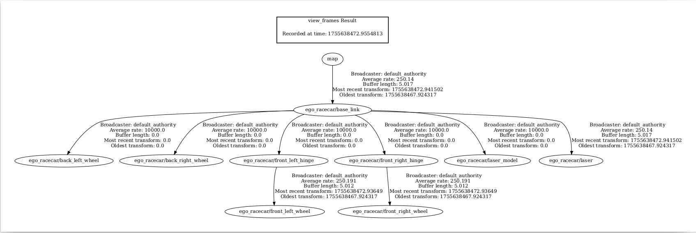

# 🏎️ F1TENTH Gym ROS2 Bridge

F1TENTH Gym 시뮬레이터와 ROS2를 연결하는 브리지 패키지입니다. 실제 F1TENTH 차량의 물리 시뮬레이션을 ROS2 환경에서 실행할 수 있습니다.

## ✨ 주요 기능

- **🏁 실시간 레이싱 시뮬레이션**: F1TENTH 차량의 물리적 특성 시뮬레이션
- **📡 센서 데이터**: LiDAR 스캔, 오도메트리 데이터 제공
- **🎮 다양한 제어**: Ackermann 드라이브, 키보드 텔레오프 지원
- **🗺️ 맵 지원**: 다양한 트랙 맵 사용 가능
- **👥 멀티 에이전트**: 단일/다중 차량 시뮬레이션

## 📁 패키지 구조

```
f1tenth_gym_ros/
├── config/
│   └── sim.yaml              # 시뮬레이션 설정 파일
├── f1tenth_gym_ros/
│   ├── __init__.py
│   ├── gym_bridge.py         # 메인 브리지 노드
│   └── teleop_twist_keyboard.py
├── launch/
│   ├── gym_bridge_launch.py  # 런치 파일
│   ├── gym_bridge.rviz       # RViz 설정
│   ├── ego_racecar.xacro     # 차량 모델 (메인)
│   └── opp_racecar.xacro     # 차량 모델 (상대방)
├── maps/
│   ├── levine.png/.yaml      # Levine 홀 맵
│   └── Spielberg_map.png/.yaml # 스필버그 맵
└── README.md
```

## ⚙️ 설정 파일

### config/sim.yaml
주요 설정 파라미터:

```yaml
# 차량 네임스페이스 및 토픽
ego_namespace: 'ego_racecar'
ego_scan_topic: 'scan'
ego_odom_topic: 'odom'
ego_drive_topic: 'drive'

# LiDAR 설정
scan_fov: 4.7                 # 시야각 (라디안)
scan_beams: 1080              # 빔 개수
scan_distance_to_base_link: 0.0

# 맵 설정  
map_path: '/path/to/map'      # ⚠️ 절대 경로 필요!
num_agent: 1                  # 에이전트 수 (1 또는 2)

# 시작 위치
sx: 0.0                       # 시작 X 좌표
sy: 0.0                       # 시작 Y 좌표 
stheta: 0.0                   # 시작 각도

# 키보드 텔레오프
kb_teleop: True               # 키보드 제어 활성화
```

## 🔄 ROS2 토픽 인터페이스

### 📤 발행 토픽 (Published Topics)

| 토픽명 | 메시지 타입 | 주파수 | 설명 |
|--------|-------------|---------|------|
| `/scan` | `sensor_msgs/LaserScan` | 250Hz | 메인 차량 LiDAR 데이터 |
| `/ego_racecar/odom` | `nav_msgs/Odometry` | 250Hz | 메인 차량 오도메트리 |
| `/map` | `nav_msgs/OccupancyGrid` | 정적 | 트랙 맵 |
| `/tf` | `tf2_msgs/TFMessage` | 250Hz | 동적 좌표 변환 |
| `/tf_static` | `tf2_msgs/TFMessage` | 정적 | 정적 좌표 변환 |
| `/joint_states` | `sensor_msgs/JointState` | 250Hz | 휠 조인트 상태 |

### 📥 구독 토픽 (Subscribed Topics)

| 토픽명 | 메시지 타입 | 설명 |
|--------|-------------|------|
| `/drive` | `ackermann_msgs/AckermannDriveStamped` | Ackermann 드라이브 제어 |
| `/cmd_vel` | `geometry_msgs/Twist` | 키보드 텔레오프 제어 |
| `/initialpose` | `geometry_msgs/PoseWithCovarianceStamped` | 차량 위치 리셋 (RViz) |

## 🎮 사용법

### 기본 실행
```bash
# 시뮬레이션 실행
ros2 launch f1tenth_gym_ros gym_bridge_launch.py

# 키보드 텔레오프 (새 터미널)
ros2 run teleop_twist_keyboard teleop_twist_keyboard
```

### 키보드 제어
| 동작 | 키 | 설명 |
|------|----|----- |
| 전진 | `i` | 직진 |
| 전진+좌회전 | `u` | 좌측 커브 |
| 전진+우회전 | `o` | 우측 커브 |
| 후진 | `,` | 후진 |
| 정지 | `k` | 정지 |

### RViz 차량 위치 설정
1. RViz에서 **"2D Pose Estimate"** 도구 선택
2. 맵상에서 차량 위치 클릭
3. 드래그하여 차량 방향 설정

## 🚗 TF (좌표 변환) 구조

<div align="center">
  
  <p><em>실제 F1TENTH 시뮬레이션의 TF 트리 구조</em></p>
</div>

```
map
└── ego_racecar/base_link
    ├── ego_racecar/laser        # LiDAR 센서
    ├── ego_racecar/front_left_hinge
    │   └── ego_racecar/front_left_wheel
    └── ego_racecar/front_right_hinge
        └── ego_racecar/front_right_wheel
```

## 📊 성능 특성

- **시뮬레이션 주파수**: 100Hz (물리 계산)
- **센서 데이터 발행**: 250Hz
- **LiDAR 범위**: 0~30m
- **차량 속도**: 최대 20m/s
- **조향각**: ±0.4 라디안

## 🗺️ 지원 맵

### Levine 홀 (기본)
- 실제 펜실베니아 대학교 Levine 홀 기반
- 복잡한 복도 구조
- SLAM 테스트에 적합

### Spielberg 맵
- F1 트랙 스타일
- 고속 주행 테스트용
- 레이싱 알고리즘 개발용

## 🔧 트러블슈팅

### 자주 발생하는 문제

1. **맵 파일을 찾을 수 없음**
   ```bash
   # config/sim.yaml에서 절대 경로 확인
   map_path: '/home/user/sim_ws/src/f1tenth_gym_ros/maps/levine'
   ```

2. **차량이 움직이지 않음**
   ```bash
   # 토픽 발행 확인
   ros2 topic echo /drive
   ros2 topic pub /drive ackermann_msgs/AckermannDriveStamped "..."
   ```

3. **RViz에서 센서 데이터가 보이지 않음**
   - Fixed Frame을 'map'으로 설정
   - LaserScan 토픽을 '/scan'으로 설정

## 🔗 관련 링크

- **F1TENTH**: https://f1tenth.org/
- **F1TENTH Gym**: https://github.com/f1tenth/f1tenth_gym
- **ROS2 Foxy**: https://docs.ros.org/en/foxy/

